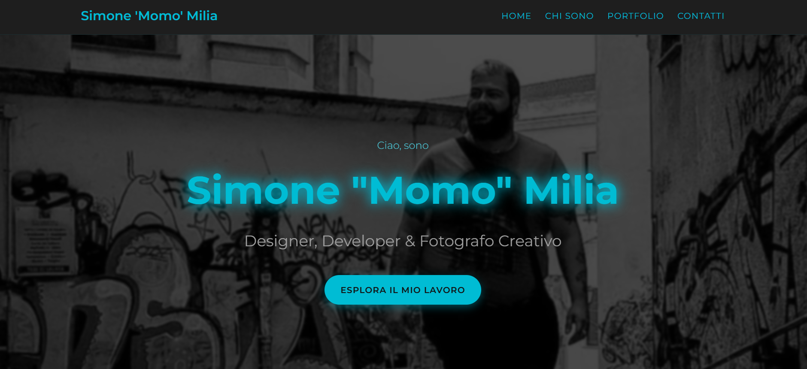
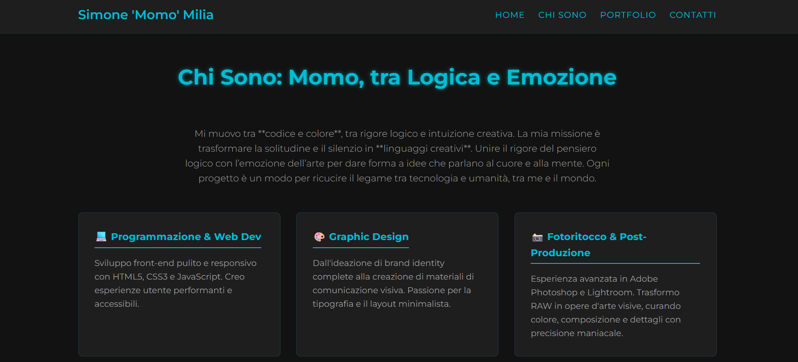
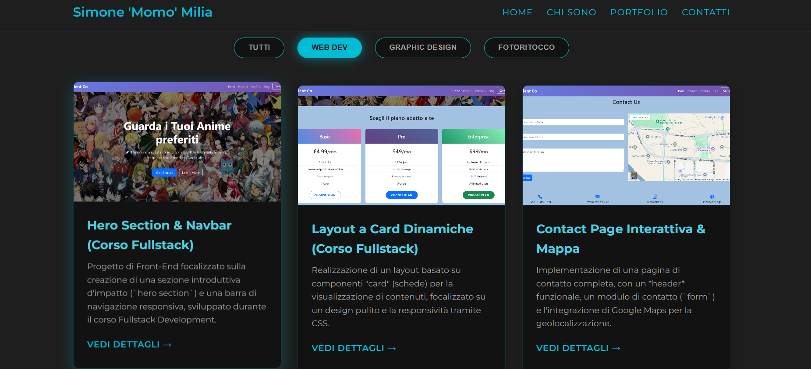
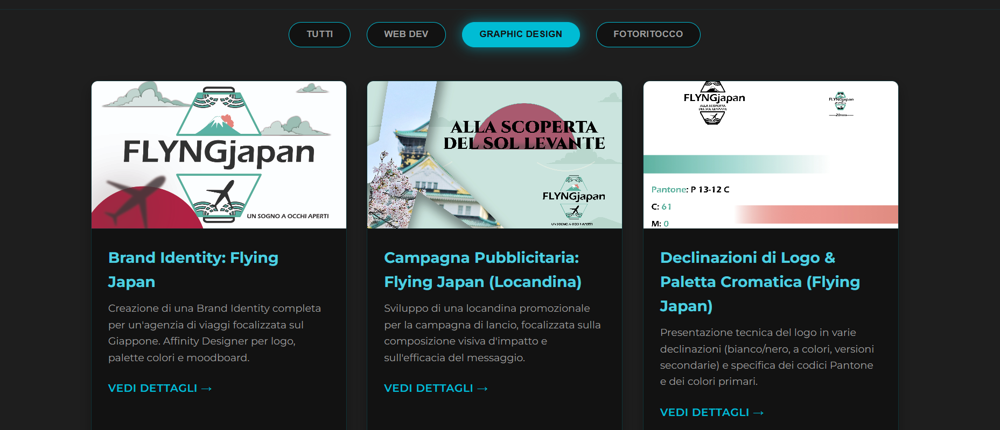
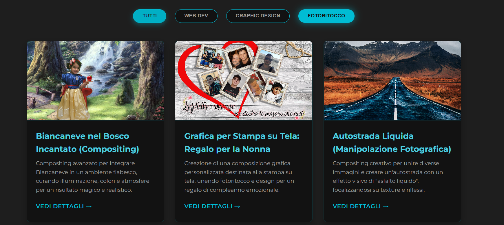
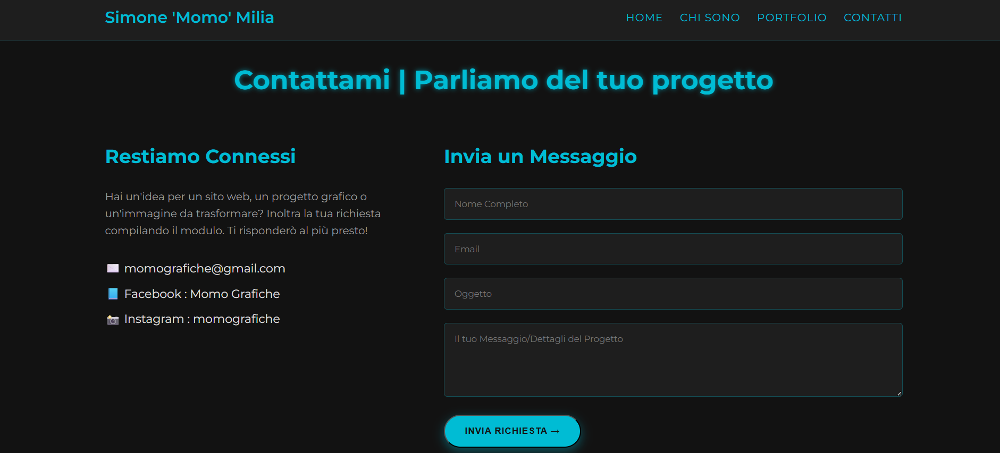

# Sito Portfolio
## Sito sviluppato durante il corso FullStack Developers
*Novembre 2025*  👨🏻‍💻


---










🔨
| Nome | Linguaggio | Versione |
|------|------------|----------|
| Html | Markup     | 5        |
| CSS  | Style      | 4        |
| JS   | Logic      | es7      |
| Node | Backend    | 22.20    |


🖥️
```bash
cd ./FILMS
npm install
npm run start
Avviare Golive da VS-Code per parte FrontEnd
